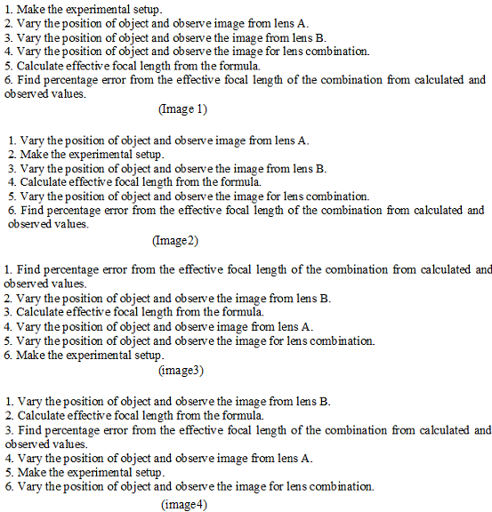

## Pedagogy (Round 1)

<b> Experiment : Measurement of focal length of the combination of two lenses separated by a distance.     

<b>Discipline | <b>Physical Sciences
:--|:--|
<b> Lab | <b> Basics of Physics
<b> Experiment|     <b> 5.Measurement of focal length of the combination of two lenses separated by a distance. 

<h4> [1. Focus Area](#LO)
<h4> [2. Learning Objectives ](#LO)
<h4> [3. Instructional Strategy](#IS)
<h4> [4. Task & Assessment Questions](#AQ)
<h4> [5. Simulator Interactions](#SI)

#### 1. Focus Area : Reinforce theoretical concept

#### 2. Learning Objectives and Cognitive Level

Sr. No |	Learning Objective	| Cognitive Level | Action Verb
:--|:--|:--|:-:
1.| Identify the relation between focal length of the lens combination and the focal length of the two lenses. | Recall | Identify
2.| Describe the methodology to vary position of object and to find the position of image to find the focal length of a lens. | Understand | Describe
3.| Predict the focal length of both the lenses separately.  | Apply | Predict
4.| Examine the focal length of the lens combination separated by distance‘d’ apart. | Analyze | Examine
5.| Conclude the effective focal length of the lens combination. | Evaluate | Conclude

 

    <b><a href="#top">↥ back to top</a></b>

 

#### 3. Instructional Strategy
###### Name of Instructional Strategy  :    Expository
###### Assessment Method: As per handout

<u> <b>Description: </b> of how you are going to implement the above Instructional Strategy in your Simulator: </u>
 
 Brief description as per handout

 

    <b><a href="#top">↥ back to top</a></b>

 

#### 4. Task & Assessment Questions:

Read the theory and comprehend the concepts related to the experiment. [LO1, LO2, LO3]
 

Sr. No |	Learning Objective	| Task to be performed by   the student  in the simulator | Assessment Questions as per LO & Task
:--|:--|:--|:-:
1.| Student will identify the relation between Focal length of the lens combination and distance between the lenses. | Student will complete introduction. He will be given 4 images for the relation between Focal length of the lens combination and distance between the lenses. | Choose the correct image for the Focal length of the lens combination and distance between the lenses.  A. Image 1    B. Image 2   C. Image 3  D. Image 4 
2.| To enable the student to describe the methodology to vary position of object and to find the position of image to find the focal length of a lens. | Student will be given 4 images for the correctprocedure to be followed in the experiment. He will choose correct image from them. | Choose the correct image for the Focal length of the lens combination and distance between the lenses.  A. Image 1    B. Image 2   C. Image 3  D. Image 4 
3.| Student will be able to Predict the focal length of both the lenses separately | Student will vary object distance and will find image distance for both the lenses separately and then for lens combination. | If d = f1 + f2 then F =?   A. 0   B. f1   C. f2   <b> D. ∞ </b>   
4.| Student will examine the focal length of the lens combination separated by distance‘d’ apart| Student will take calculate effective focal length for the values of d, f1 and f2 | Focal length of the lens A is?   A. +20cm   B. +40cm   C. +30cm   <b> D. +35cm </b>    
5.| Conclude the effective focal length of the lens combination. | Students will calculate the percentage error occurred between the value of effective focal length calculated for the formula and the focal length of the combination observed experimentally | Focal length of the lens A is?   A. +20cm   B. +40cm   C. +30cm   <b> D. +35cm </b>   

  

    <b><a href="#top">↥ back to top</a></b>

 

#### 4. Simulator Interactions:
 

Sr.No | What Students will do? |	What Simulator will do?	| Purpose of the task
:--|:--|:--|:--:
1.| Simulator will allow student to make setup and will alert him in case of wrong setup made. | Student will slide the power button of the simulator to ON position.  | To initiate the simulator
2.| Simulator will show the green light indicating that the simulator is ready for use.  | Student will choose the lens A and vary the object distance and  observe the image distance to find f1 | To find focal length of lens A
3.| Simulator will show corresponding image distance | Student will insert the values of object and image distance in the table.  | To find focal lens of the first lens.
4.| Simulator will calculate focal length.| Student will choose the lens B and repeat the same procedure | To find focal lens of the Second lens.
5.| Simulator will calculate focal length of lens combination. | Student will choose the combination of lens A and lens B separated by distance‘d’ apart.  | Student will note the value of the effective focal length of the combination and calculate the same from formula and will also calculate the percentage error.
6.| Percentage error will be calculated. | Student will change the distance between the lens and will repeat the experiment  | Student will again note the value of the effective focal length of the combination and calculate the same from formula and will also calculate the percentage error
