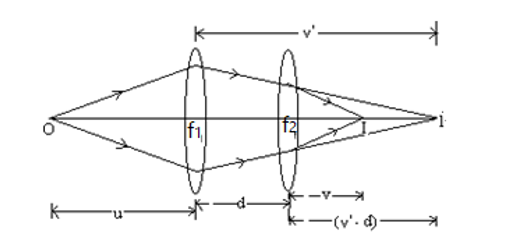
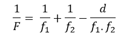

Consider two lenses, first lens having focal length f1 and the second lens having focal length f2, both the lenses are separated by distance ‘d’ apart. Any point object ‘O’ placed on the principal axis of the first lens at a distance ‘u’ from the lens forms its image at point I at a distance ‘v’ from the first lens. This image serves as object for the second lens and the second lens forms its image at distance v. This situation is clearly depicted from the ray diagram given below:   
 
On applying the lens formula (detailed derivation is given in reference [6]) for both the lenses separately and further solving we get:  
 
Where ‘F’ is the focal length of the combination of the two lenses of focal lengths f1 and f2 separated by distance d apart.